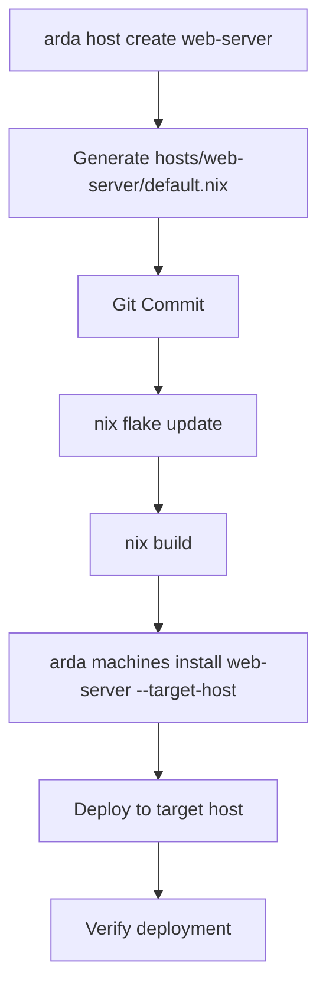

# Architecture: Arda

**Date:** 2025-11-14
**Author:** BMAD Decision Architecture Workflow
**For:** Lord

---

## Executive Summary

Arda is a minimal, sustainable infrastructure management tool for NixOS that forks the clan-core project. It introduces a **Service/Feature/Role hierarchy** as its key differentiator from clan, providing composable functionality through explicit role compositions rather than direct service imports. Built with a brownfield foundation (extracting from clan-core) but greenfield execution (new arda-v1 branch), Arda targets a days/weeks MVP focused on secure secret management, CLI automation, and decade-scale maintainability.

**Core Innovation:** Unlike clan's service-only approach, Arda organizes functionality into Services (actual software like nginx-server) → Features (optional service groupings) → Roles (user-facing compositions like web-server role = nginx + certbot + firewall). This provides a more intuitive and composable architecture for infrastructure management.

The architecture emphasizes **CLI-first automation** where users never manually edit configuration files except for advanced customization. All host management happens through `arda` commands: `arda host create`, `arda roles add`, `arda secrets init`, etc. The abstraction layer (`arda-core.lib.arda`) automatically discovers hosts from the `hosts/` directory and generates `nixosConfigurations`, eliminating merge conflicts and manual inventory management.

**Success Criteria:** 95%+ deployment success rate, <1 hour time to deploy first machine, zero secrets in version control, 50% code reduction from clan-core baseline, and decade-scale maintainability through opinionated simplicity.

## Project Initialization

**First implementation story:** Create the GitHub repository and initialize the arda-v1 branch.

```bash
# Initialize repository structure
git clone https://github.com/lorddevi/arda-core.git
cd arda-core
git checkout -b arda-v1
git branch --set-upstream-to origin/arda-v1

# Or create new repository
gh repo create lorddevi/arda-core --public
git init -b arda-v1
```

This establishes the base architecture with the following initial decisions:

- **Foundation:** Minimal subset of clan-core code
- **Structure:** Clear separation of concerns (pkgs/, Nix modules, templates)
- **Innovation:** Service/Feature/Role hierarchy from day one
- **Automation:** CLI-first, no manual configuration files

## Decision Summary

| Category | Decision | Version | Affects Epics | Rationale |
| -------- | -------- | ------- | ------------- | --------- |
| **Foundation** | Extract minimal subset from clan-core | Latest clan-core | All epics | Proven code, faster development, focus on innovation |
| **Directory Structure** | Option A: Clan-inspired hierarchy | N/A | All epics | Clear profiles/, roles/, services/ separation, scalable |
| **CLI Commands** | Option B: Service/Feature/Role focused | N/A | Epic 2, 3 | First-class support for key differentiator, matches Product Brief |
| **Service Architecture** | Services → Features → Roles hierarchy | N/A | Epic 3 | Clear separation: services (software) → features (groupings) → roles (user-facing) |
| **Secret Management** | Direct sops-nix integration | sops-nix v2.x | Epic 5 | Proven approach, fastest implementation, highest risk mitigation |
| **Abstraction Layer** | Auto-discovery from hosts/ directory | N/A | Epic 6 | Single source of truth, no merge conflicts, matches Product Brief |
| **Machine Config** | Complete CLI automation + smart defaults | N/A | Epic 2 | No manual file editing except advanced customization |
| **Template System** | Extensible templates in templates/disk/ | N/A | Epic 4 | Path to ZFS support, user-friendly CLI application |
| **Version Pinning** | Flake input pinning to specific versions | N/A | All epics | Standard Nix approach, reproducible, reversible updates |
| **Testing Strategy** | Minimal MVP testing | N/A | All epics | Focus on getting MVP working, days/weeks timeline |
| **Documentation** | Minimal + examples | N/A | All epics | Simple, example-driven, quick to create |

## Project Structure

```
arda-core/
├── pkgs/                          # Package directory (allows future expansion)
│   └── arda-cli/                  # CLI tool (extracted/modified from clan-cli)
│       ├── commands/
│       │   ├── host.py           # host create, host list, host delete
│       │   ├── roles.py          # roles list, roles add, roles remove
│       │   ├── services.py       # services list, services add
│       │   ├── features.py       # features list, features add
│       │   ├── secrets.py        # secrets init, secrets add, secrets deploy
│       │   ├── templates.py      # templates apply, templates list
│       │   ├── vars.py           # vars set, vars get
│       │   └── machines.py       # machines install, machines deploy (legacy compatibility)
│       ├── lib/
│       │   └── arda/             # Shared CLI utilities
│       └── pyproject.toml
│
├── modules/nixos/
│   ├── profiles/
│   │   ├── services/
│   │   │   ├── admin/
│   │   │   ├── sshd/
│   │   │   ├── nginx-server/
│   │   │   ├── postgresql-server/
│   │   │   └── ...
│   │   ├── features/             # Optional: service groupings
│   │   │   ├── web-feature/
│   │   │   └── database-feature/
│   │   └── common/               # Common configurations for all hosts
│   │       ├── timezone.nix
│   │       ├── network.nix
│   │       └── users.nix
│   ├── roles/                    # Role compositions (1+ features/services)
│   │   ├── web-server/
│   │   │   └── default.nix
│   │   ├── nix-cache/
│   │   │   └── default.nix
│   │   └── ...
│   └── lib/
│       └── arda.nix              # Nix utility functions
│
├── templates/
│   ├── disk/
│   │   ├── single-disk/
│   │   │   ├── default.nix       # ext4 template (MVP)
│   │   │   └── template.yaml
│   │   └── zfs-root/             # Future: ZFS + impermanence
│   │       ├── default.nix
│   │       └── template.yaml
│   └── machine/
│       └── new-machine/
│           └── default.nix
│
├── hosts/                        # User host configurations
│   ├── web-server/
│   │   └── default.nix
│   └── db-server/
│       └── default.nix
│
├── lib/
│   └── arda.nix                  # arda-core.lib.arda abstraction layer
│       └── flake.nix             # Main flake
│
└── docs/                         # Documentation
    ├── README.md
    ├── installation.md
    ├── usage.md
    ├── roles/
    │   ├── web-server.md
    │   └── nix-cache.md
    └── troubleshooting.md
```

## Epic to Architecture Mapping

| Epic | Architecture Component | Implementation Strategy |
| ---- | ---------------------- | ---------------------- |
| **Epic 1: Installation Workflow** | `pkgs/arda-cli`, `lib/arda.nix` | Extract/adapt clan-cli installation, add `arda host create`, GitHub repo guidance |
| **Epic 2: Machine Management** | `commands/machines.py`, `commands/host.py` | `arda host create` creates `hosts/<hostname>`, `arda machines install` deploys |
| **Epic 3: Service/Feature/Role Architecture** | `modules/nixos/{profiles,roles}` | NEW: Services = software, Features = groupings, Roles = user-facing compositions |
| **Epic 4: Template System** | `templates/`, `commands/templates.py` | Extensible template system, disk layouts, user-friendly CLI |
| **Epic 5: Secret Management** | `commands/secrets.py`, `sops-nix integration` | Direct sops-nix approach, `arda secrets init/add/deploy`, age-based encryption |
| **Epic 6: Abstraction Layer** | `lib/arda.nix`, `modules/nixos/lib/arda.nix` | Auto-discovery from `hosts/`, generates `nixosConfigurations` |
| **Epic 7: Development Environment** | `flake.nix`, devShell | `nix develop` shell, arda-cli available, branch management helpers |

## Technology Stack Details

### Core Technologies

| Technology | Purpose | Version Strategy | Arda Usage |
| ---------- | ------- | ---------------- | ---------- |
| **NixOS** | Configuration management | Pin via flake inputs | Base operating system, all host configs |
| **Nix Flakes** | Packaging and distribution | Latest stable | Package management, dependency locking |
| **Nix Language** | Configuration DSL | NixOS channel version | All Nix modules, configurations |
| **Python 3.13** | CLI implementation | Latest stable | arda-cli tool, all commands |
| **sops-nix** | Secret management | Latest stable | Age-based encryption, secret distribution |
| **age** | Encryption | Latest stable | File encryption, key generation |

### Integration Points

- **Clan-core Integration:** Extract minimal subset of proven code (machines, secrets, templates, vars, state modules)
- **Nix Ecosystem:** Standard flake integration, compatible with existing Nix workflows
- **Git Integration:** Automatic commits for configuration changes (extracted from clan)
- **SSH Integration:** Deployment and remote management (extracted from clan)

### Innovation: Service/Feature/Role Architecture

**Example Implementation:**

```nix
# modules/nixos/profiles/services/nginx-server/default.nix
{ lib, ... }: {
  options = {
    services.nginx-server.enable = lib.mkEnableOption "Nginx web server";
  };
  config = lib.mkIf config.services.nginx-server.enable {
    services.nginx = {
      enable = true;
      # Arda-specific configuration
    };
  };
}

# modules/nixos/roles/web-server/default.nix
{ lib, inputs, ... }: {
  options = {
    roles.web-server.enable = lib.mkEnableOption "Web server role";
  };
  config = lib.mkIf config.roles.web-server.enable {
    imports = [
      inputs.arda-core.nixosModules.services-nginx-server
      inputs.arda-core.nixosModules.services-certbot
      inputs.arda-core.nixosModules.services-firewall
    ];
  };
}

# hosts/web-server/default.nix
{ lib, ... }: {
  # Simple role assignment
  roles.web-server.enable = true;

  # Common config
  common.hostname = "web-server";
  common.timezone = "UTC";
}
```

This hierarchy provides:

- **Services:** Actual software packages with minimal configuration
- **Roles:** User-facing compositions that combine multiple services
- **Clear separation:** Users think in roles (web-server) not individual services
- **Composability:** Roles can combine services and/or features
- **Flexibility:** Advanced users can bypass roles and configure services directly

## Implementation Patterns

These patterns ensure consistent implementation across all AI agents:

### Naming Conventions

**Nix Modules:**

- Services: `{service-name}-server` or `{service-name}` (e.g., `nginx-server`, `sshd`)
- Features: `{feature-name}-feature` (e.g., `web-feature`)
- Roles: `{role-name}-role` or `{role-name}` (e.g., `web-server`)
- Options: `services.{name}`, `features.{name}`, `roles.{name}`

**CLI Commands:**

- Noun-verb structure: `host create`, `roles add`, `secrets init`
- Plural nouns for listings: `hosts list`, `roles list`, `services list`
- Singular nouns for operations: `host create`, `role add`

**Directories:**

- Lowercase, hyphen-separated: `nginx-server/`, `web-server/`
- Clear hierarchy: `profiles/services/`, `profiles/features/`, `roles/`

### Code Organization Patterns

**CLI Structure:**

```
pkgs/arda-cli/
  ├── commands/
  │   ├── {command}.py          # Command implementation
  │   ├── __init__.py
  │   └── ...
  └── lib/                      # Shared utilities
      └── arda/
```

**Nix Module Structure:**

```
modules/nixos/
├── profiles/
│   ├── services/{name}/default.nix
│   ├── features/{name}/default.nix
│   └── common/{config}.nix
└── roles/{name}/default.nix
```

**Host Configuration:**

```
hosts/{hostname}/default.nix
```

### Error Handling Approach

- **Fail-fast:** Validate inputs before making changes
- **Clear messages:** Human-readable error messages with suggested fixes
- **Rollback:** Git-based rollback for configuration changes
- **Validation:** Nix evaluation catches configuration errors early

### Logging Approach

**CLI Logging:**

- Structured logging (JSON for automation, human-readable for terminals)
- Log levels: DEBUG, INFO, WARN, ERROR
- Context: hostname, command, user

**System Logging:**

- Standard NixOS logging
- Service-specific logs via journalctl
- Secret access logging (sops-nix)

## Data Architecture

### Configuration Data Flow

```
User CLI Command
    ↓
arda-cli (Python)
    ↓
Generate/Update Config File
    ↓
Git Commit
    ↓
Nix Evaluation (lib/arda.nix)
    ↓
Auto-Discovery of hosts/
    ↓
Generate nixosConfigurations
    ↓
NixOS System Build
    ↓
Deploy to Target Host
```

### Configuration Files

| File | Purpose | Managed By |
| ---- | ------- | ---------- |
| `hosts/{hostname}/default.nix` | Host-specific configuration | CLI + Manual |
| `hosts/{hostname}/hardware.nix` | Hardware configuration | Manual |
| `.sops.yaml` | Secret encryption rules | CLI (secrets init) |
| `flake.nix` | Flake inputs and outputs | Manual |
| `flake.lock` | Dependency lock file | Automatic (nix flake update) |

## Security Architecture

### Secret Management

- **Encryption:** age-based encryption via sops-nix
- **Storage:** Encrypted files in repository (never commit unencrypted secrets)
- **Distribution:** Automatic distribution to target hosts during deployment
- **Key Management:** Age keys generated via `arda secrets init`, distributed to hosts
- **Access Control:** sops-nix policies control which services can access which secrets

### Authentication & Authorization

- **SSH:** Key-based authentication for deployment
- **Host Verification:** SSH host key checking
- **User Access:** Per-host user configuration via `modules/nixos/profiles/common/users.nix`

### Security Best Practices

- Zero secrets in version control (enforced by sops-nix)
- Principle of least privilege for service access
- Automatic secret rotation capability
- Validation of all configurations before deployment

## Performance Considerations

### Build Performance

- **Nix Caching:** Leverage Nix's build caching for repeated builds
- **Incremental Builds:** Only rebuild changed components
- **Flake Inputs:** Pinned dependencies for reproducible builds

### Deployment Performance

- **Target:** <1 hour from clone to running machine
- **Optimization:** Pre-built system closures where possible
- **Network:** Efficient secret and configuration distribution

### Resource Requirements

- **Build Host:** Standard x86_64-linux machine with Nix installed
- **Target Host:** Standard NixOS machine
- **Memory:** Adequate for Nix builds (depends on service complexity)

## Deployment Architecture

### Deployment Flow



### Environments

- **Development:** Local nix development shell (`nix develop`)
- **Staging:** Test deployments on non-production hardware
- **Production:** Production deployments with verification

### Version Management

```nix
# user's flake.nix
{
  inputs = {
    arda-core.url = "github:lorddevi/arda-core/v1.0.0";
    arda-core.inputs.nixpkgs.follows = "nixpkgs";
  };
}
```

- Pin to specific versions via flake inputs
- Update via `nix flake update` (no git pull, no merge conflicts)
- Reversible: easy rollback to previous versions

## Development Environment

### Prerequisites

- Nix package manager installed
- Git
- age (for secret management)
- SSH (for deployments)

### Setup Commands

```bash
# Clone repository
git clone https://github.com/lorddevi/arda-core.git
cd arda-core

# Enter development shell (includes arda-cli)
nix develop

# Verify installation
arda --version

# Create first host
arda host create web-server
arda roles add web-server web-server
arda templates apply disk single-disk web-server

# Build and deploy
nix build
arda machines install web-server --target-host user@192.168.1.100
```

### Development Workflow

```bash
# Daily workflow
nix develop                    # Enter dev shell
arda --help                    # Test CLI
nix build                      # Build flake
nix flake check                # Validate
git add -A && git commit -m "Update configuration"
nix flake update              # Update dependencies (if needed)
```

## Architecture Decision Records (ADRs)

### ADR-001: Service/Feature/Role Hierarchy

**Status:** Accepted
**Context:** Unlike clan's service-only approach, Arda needs a more intuitive way to compose functionality.
**Decision:** Implement Services → Features → Roles hierarchy where:

- Services = actual software (nginx-server, postgresql-server)
- Features = optional service groupings (web-feature = nginx + certbot)
- Roles = user-facing compositions (web-server role = nginx + certbot + firewall)
**Consequences:**
- Users think in roles (web-server) not individual services
- Clearer mental model for infrastructure composition
- Backwards compatible: users can bypass roles and configure services directly

### ADR-002: CLI-First Automation

**Status:** Accepted
**Context:** Manual configuration file editing causes merge conflicts and complexity.
**Decision:** Complete CLI automation where users never manually edit configuration files except for advanced customization.
**Consequences:**

- No merge conflicts (no git pull, only nix flake update)
- Guided user experience
- Consistent configurations
- Faster onboarding for new users

### ADR-003: Single Source of Truth

**Status:** Accepted
**Context:** Clan has confusing dual approach (machines/ directory + manual clan.nix).
**Decision:** Single source of truth in hosts/ directory managed by CLI.
**Consequences:**

- No confusion about which method to use
- Easier to understand and maintain
- Clear ownership (CLI manages everything)

### ADR-004: Direct sops-nix Integration

**Status:** Accepted
**Context:** Secret management is highest complexity risk but critical for MVP.
**Decision:** Use direct sops-nix integration (not custom wrapper) for fastest implementation.
**Consequences:**

- Proven, reliable approach
- Fast to implement (1-2 weeks vs 3-4 weeks)
- User still learns sops-nix
- Focus development effort on Service/Feature/Role innovation

### ADR-005: Auto-Discovery Abstraction Layer

**Status:** Accepted
**Context:** Manual inventory management is error-prone and creates merge conflicts.
**Decision:** Implement arda-core.lib.arda that auto-discovers hosts from hosts/ directory and generates nixosConfigurations.
**Consequences:**

- No manual inventory management
- No merge conflicts
- Simple user experience (just create host files)
- Matches Product Brief exactly

### ADR-006: Package Structure with pkgs/

**Status:** Accepted
**Context:** Clan uses `pkgs/clan-cli` structure. Future expansion may include additional packages.
**Decision:** Use `pkgs/arda-cli/` directory structure matching clan's approach.
**Consequences:**

- Clean future expansion (pkgs can contain multiple packages)
- Familiar structure to clan users
- Standard flake module integration
- Prepares for potential future packages beyond CLI

---

**Summary:** This architecture provides a solid foundation for Arda's MVP while positioning it for long-term success. The brownfield extraction approach (from clan-core) ensures proven code and faster development, while the greenfield innovations (Service/Feature/Role hierarchy, CLI automation, auto-discovery) differentiate Arda and provide a superior user experience.

The focus on secret management, CLI automation, and decade-scale maintainability aligns with the Product Brief's goals of creating a sustainable infrastructure management tool that Lord can learn from and use for decades.

---

_Generated by BMAD Decision Architecture Workflow v1.0_
_Date: 2025-11-14_
_For: Lord_
